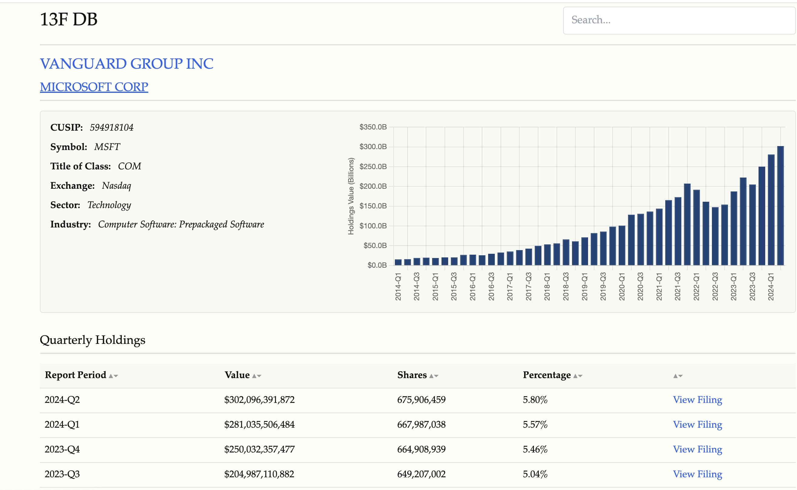

# 13f-db

A tool for downloading and processing SEC 13F filings data, storing it in a PostgreSQL database, and providing a web interface with search.

## Setup

1. Clone the repository
2. Install dependencies
3. Create a `.env` file with your database credentials and SEC user agent:

    ```
    DB_NAME=your_db_name
    DB_USER=your_db_user
    DB_PASSWORD=your_db_password
    DB_HOST=localhost
    USER_AGENT="Your Name your@email.com"
    ```

## Usage

CLI commands:

```
python cli.py r    # Reset database
python cli.py d    # Download 13F data
python cli.py p    # Process downloaded data
python cli.py pp   # Post-process data
python cli.py f    # Full pipeline: reset, download, process, post-process
python cli.py u    # Update with current quarter's data
```

Example usage with date range:

```
python cli.py d 2023-Q1 2023-Q4
python cli.py p 2023-Q1 2023-Q4
```

Use `python cli.py --help` for more details on each command.

Note: CUSIP symbol mapping and sector/industry data not included. You'll need to source these separately.

## Web Application

Launch with: `python app.py`

Access the application at `http://localhost:5000`




